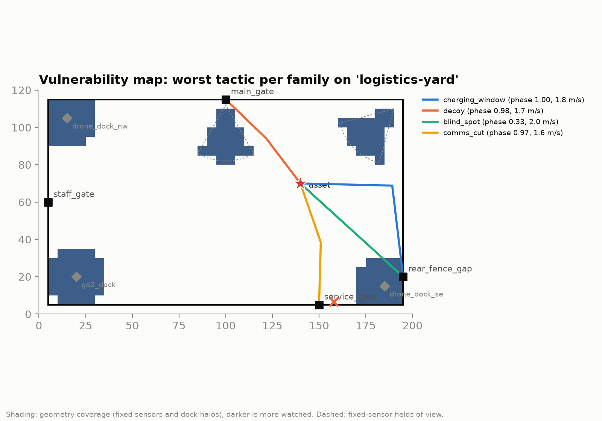
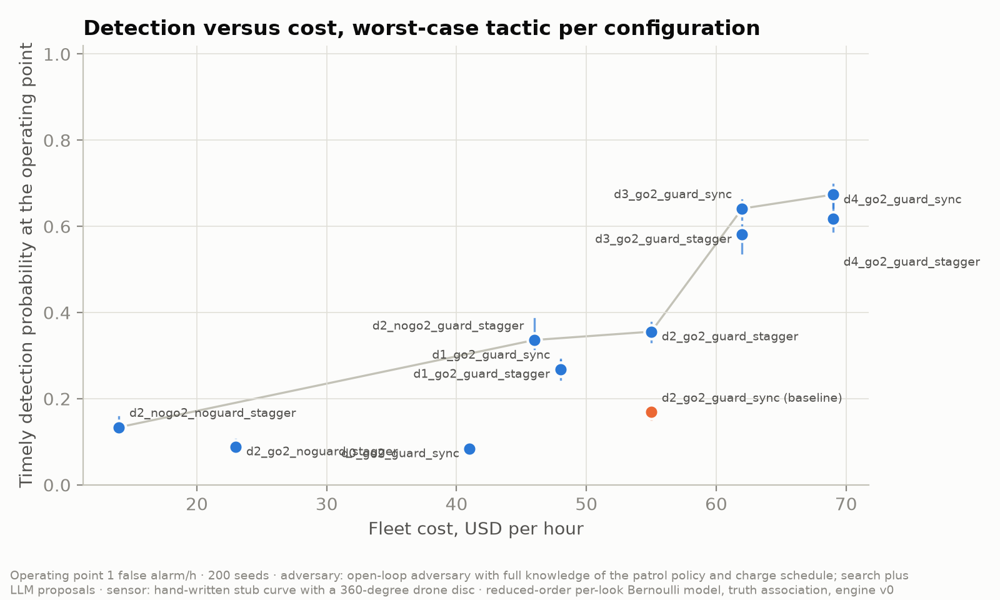
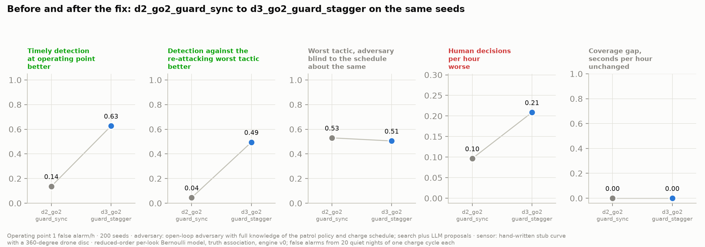
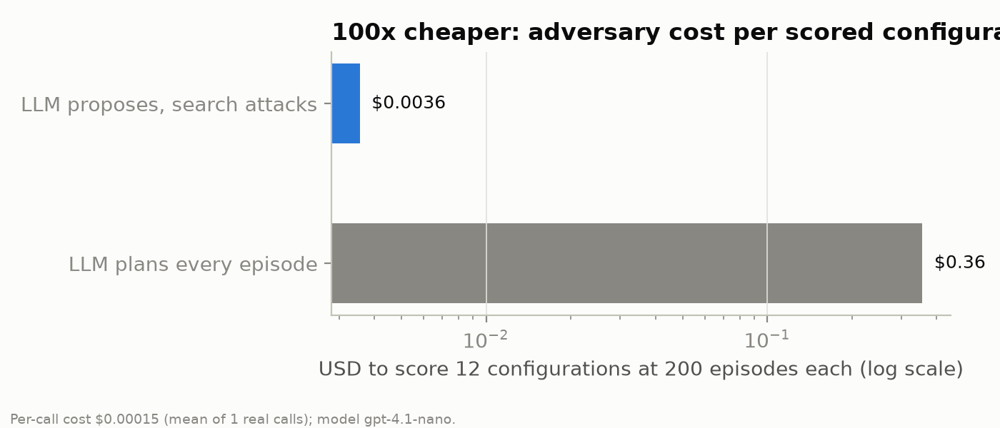

# Airtight

## How secure is this site, and what should you buy?

A security score and a vulnerability map for building owners, insurers and security firms, before any robot is purchased, and a re-score after.

---

# Site twin and mixed fleet

Drones, a ground robot and guards bid in one auction. Batteries and docks make coverage continuity real.

---

# The red team

Four tactic families: charging window, decoy, blind spot, comms cut.

An LLM proposes; search attacks. Every tactic passes one validator.

- **charging_window**: entry `rear_fence_gap`, phase 1.00, 1.8 m/s, origin random
- **decoy**: entry `main_gate`, phase 0.98, 1.7 m/s, origin random
- **blind_spot**: entry `rear_fence_gap`, phase 0.33, 2.0 m/s, origin search
- **comms_cut**: entry `service_gate`, phase 0.52, 2.0 m/s, origin search

---

# What the adversary found

Charging-window attack: enter `rear_fence_gap` at phase 1.00 of the charge cycle at 1.8 m/s.

*Replay clip A: the miss.*

Clip A, seed 63663: d2_go2_guard_sync never raised a timely alarm against `charging_window-439068210` (deadline 34 s).

---

# The score

<small>Operating point 1 false alarm/h · 200 seeds · adversary: open-loop adversary with full knowledge of the patrol policy and charge schedule; search plus LLM proposals · sensor: hand-written stub curve with a 360-degree drone disc · reduced-order per-look Bernoulli model, truth association, engine v0</small>

---

# The fix and the re-attack

d2_go2_guard_sync to d3_go2_guard_stagger: detection 0.17 to 0.58; against the re-attacking worst tactic 0.07 to 0.45.

*Replay clip B: the catch.*

Clip B, same seed and tactic: d3_go2_guard_stagger alarmed at 24 s, before the 34 s deadline.

---

# Human attention is a cost

Human decisions per hour: 12.04 to 41.03. Coverage gap: 0 to 0 s/h.

Adversary cost per scored configuration: 100x cheaper than an LLM planning every episode (mean of 2 real calls).

---

# What we sell, and what is next

- The score, the vulnerability map, and a re-score after purchase
- Next: learned adversary, calibrated sensors on more platforms, fleet memory under link loss

<small>Operating point 1 false alarm/h · 200 seeds · adversary: open-loop adversary with full knowledge of the patrol policy and charge schedule; search plus LLM proposals · sensor: hand-written stub curve with a 360-degree drone disc · reduced-order per-look Bernoulli model, truth association, engine v0</small>
